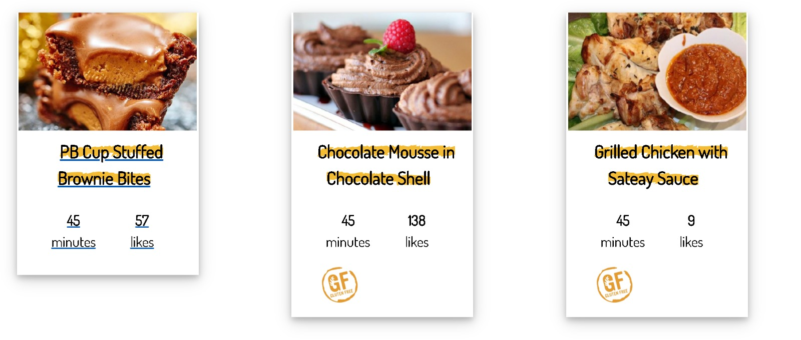
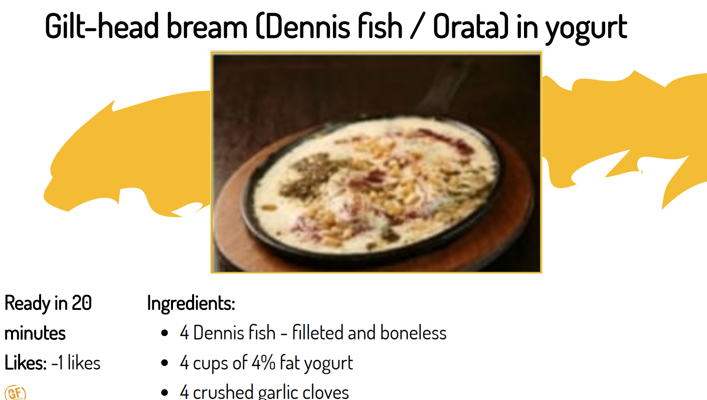
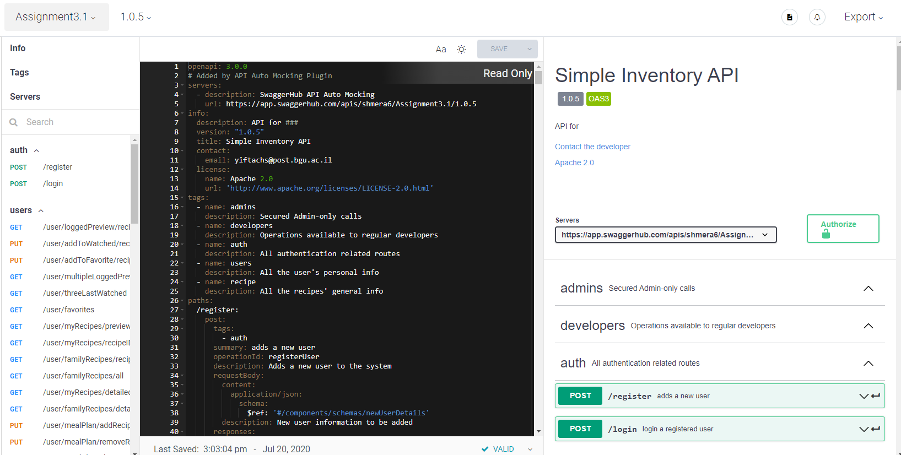
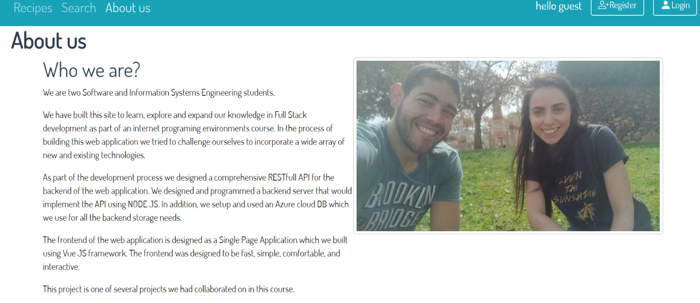

# Web-Development-Environments-Recipe-Website

This repository includes the final project submitted as part of the Web Development Environments course at the Ben-Gurion University of the Negev. 

The course deals with environments, developing tools and technologies for Web design and Programming. Topics that were covered include: Survey of **advanced search tools in the Web**; **Principles of Scripting languages**, **Java Script** and **Visual Studio Code**; tools and methods for designing Internet sites (e.g. Nielsen's approach); methods for Internet sites evaluation; **HTML advanced Editor**; **Cascading Style Sheets (CSS)**; SGML standard and XML language; Management of HTTP servers; Documents Object Model (DOM); Implementation of java Applets in HTML & Dynamic HTML; Server side programming and Client side programming; connection with legacy systems.

## Recipe Website

  
  

Merav Shaked | Yiftach Savransky | [additional repo](https://github.com/SISE-Web-Development-Environments/assignment-3-2-v2-yiftach-merav)

The project goal is to implement a culinary recipe website. The project mimics a Full Stack development scenario in which, we, the developers, receive an initial Product Requirements Document (PRD) and are asked to implement it. 
The project was built in three phases:
 
### [First Phase – API](https://app.swaggerhub.com/apis/shmera6/Assignment3.1/1.0.5)

The goal of the API file is to create a “contract” between the client and the server. It establishes an agreement on the resources and actions of the server and how to get/request them. We used swagger with OpenAPI Specification – Version V3 format.
 
### [Second Phase – Backend Development]()

We implemented the server side using NODE.JS and EXPRESS.JS, according to the API written in the first phase. The recipe data is acquired through the API of [spoonacular](https://spoonacular.com/food-api). All the data of the clients is stored using AZURE DB. The system was engineered to handle and administer routes, cookies, users, and passwords.
 

### [Third Phase – Frontend development]()

the frontend was developed using Vue.JS, and Vue CLI tooling. Additionally, we used the Bootstrap design library. A secondary goal of the design was to develop separate pages and components.

  
  

